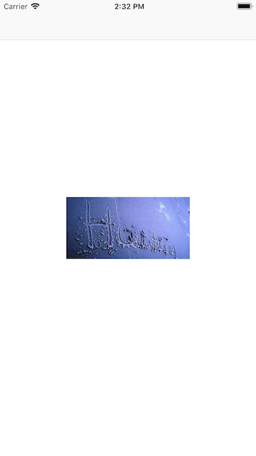
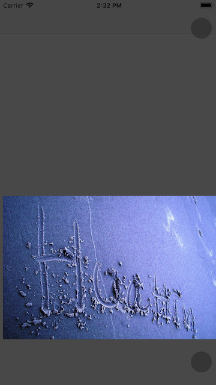

# BNImagePageView

[](https://travis-ci.org/chanon-apimaha/BNImagePageView)
[](https://cocoapods.org/pods/BNImagePageView)
[](https://github.com/chanon-apimaha/BNImagePageView/blob/master/LICENSE)
[](https://cocoapods.org/pods/BNImagePageView)

## Example





To run the example project, clone the repo, and run `pod install` from the Example directory first.

## Requirements

```ruby
swift '4.2', ios version '9.0+'
```

## Installation

BNImagePageView is available through [CocoaPods](https://cocoapods.org). To install
it, simply add the following line to your Podfile:

```ruby
pod 'BNImagePageView'
```

## Author

Banchai Nangpang, pong.np1@gmail.com

## License

BNImagePageView is available under the MIT license. See the [LICENSE](https://github.com/chanon-apimaha/BNImagePageView/blob/master/LICENSE) file for more info.
